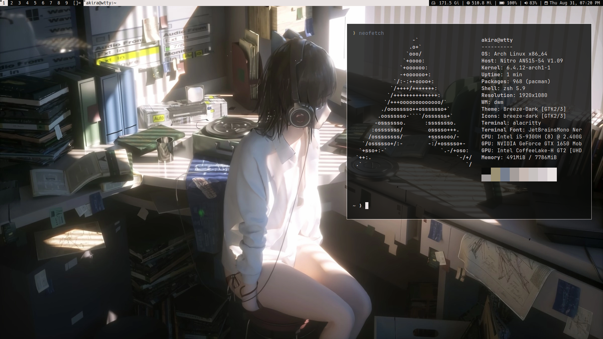
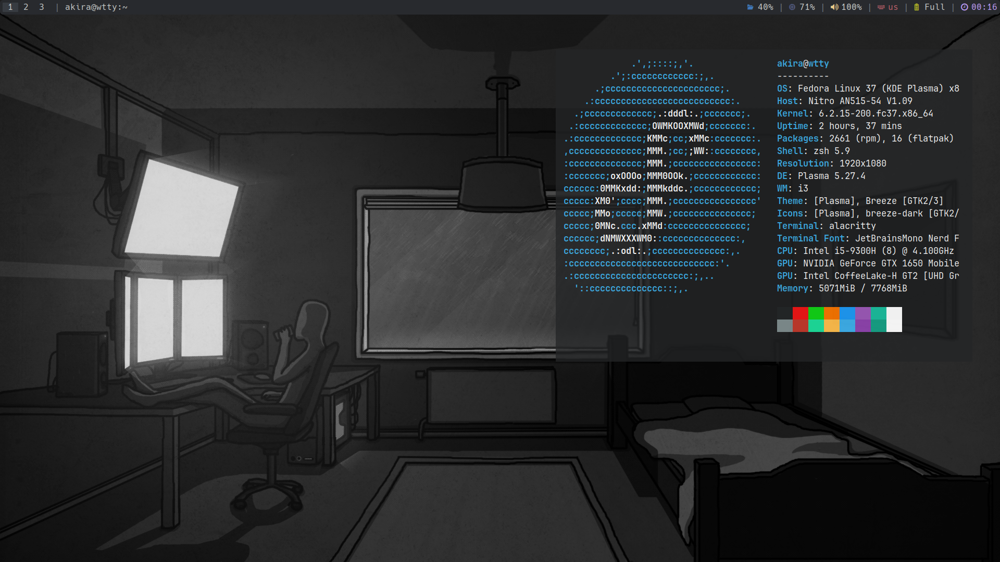

# dotfiles
This is my personal collection of configuration files. The setup is very minimal and personalized. Feel free to use it and customize it to suit your needs.

## Info
My setup information

* OS: [Arch Linux](https://archlinux.org/download/)
* Terminal: [kitty](https://sw.kovidgoyal.net/kitty/)
* WM: [dwm](https://github.com/sembekov/dwm)
* Shell: [zsh](https://www.zsh.org/)
* Compositor: [picom](https://github.com/FT-Labs/picom)
* Theme: [Adwaita-Dark](https://www.gnome-look.org/p/1014995/), [Breeze-Dark](https://store.kde.org/p/1168533/)
* Text Editor: [neovim](https://github.com/neovim/neovim)

## Screenshots

